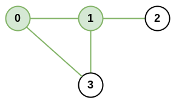

# Explanation: 
There is an infrastructure of n cities with some number of roads connecting these cities. Each `roads[i] = [ai, bi]` indicates that there is a bidirectional road between cities `ai` and `bi`.

The network rank of two different cities is defined as the total number of directly connected roads to either city. If a road is directly connected to both cities, it is only counted once.

The maximal network rank of the infrastructure is the maximum network rank of all pairs of different cities.

Given the integer `n` and the array roads, return the maximal network rank of the entire infrastructure.

Example 1:


```
Input: n = 4, roads = [[0,1],[0,3],[1,2],[1,3]]
Output: 4
Explanation: The network rank of cities 0 and 1 is 4 as there are 4 roads that are connected to either 0 or 1. The road between 0 and 1 is only counted once. For the pair {2, 3}, the network rank is 3. For the pair {0,3} the network rank is 3.
```

# Solution: DFS
## Problem Analysis:
* is there "disjoined network"? 
## Algorithm:
* create 2d array `adjList` to store the connections each node has. `row: node, col: the adjacent nodes`. The number of connections is the number of col for each row
* *construct a graph*
    * mark each node with the number of connections via array `connection[currentNode]`
    * neighbor node: get adjNode from adjList.
        * `networkRank = connection[currentNode] + connect[adjNode]`;  if the 2 nodes are connected, `networkRank = connection[currentNode] + connect[adjNode] - 1`
        * compared with max value
    * add neighbor to dfsStack to check the next node

# Solution: use double for loop.
## Algorithm:
* create 2d array `adjList` to store the connections each node has. `row: node, col: the adjacent nodes`. The number of connections is the number of col for each row
* instead of using DFS to get the next node, simply use double for loop the get any pair of nodes. 