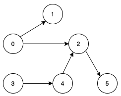
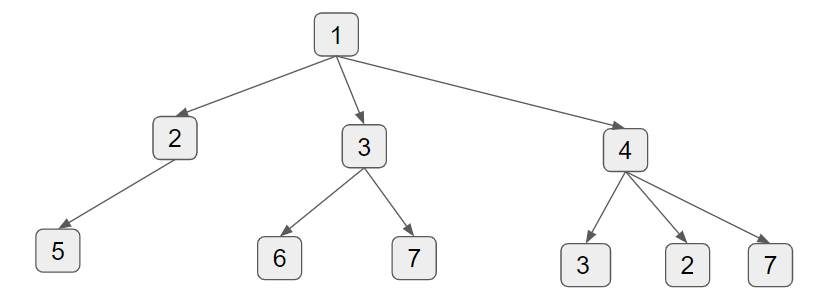

# Description:

Given a directed acyclic graph, with `n` vertices numbered from `0` to `n-1`, and an array edges where `edges[i] = [nodeA, nodeB]` represents a directed edge from node nodeA to `nodeA` `nodeB`.

Find the smallest set of vertices from which all nodes in the graph are reachable. It's guaranteed that a unique solution exists.

Notice that you can return the vertices in any order.

* Example 1: 



```
Input: n = 6, edges = [[0,1],[0,2],[2,5],[3,4],[4,2]]
Output: [0,3]
Explanation: It's not possible to reach all the nodes from a single vertex. From 0 we can reach [0,1,2,5]. From 3 we can reach [3,4,2,5]. So we output [0,3].
```

# Solution:
## Problem Analysis: 
* are there cross-edges and back-edges?
    * corss-edge: yes. back-edge: no.\
    * therefore, simple counting outdegree of each node, and pick the nodes with higher outdegree is not suitable.
    * For example, the following shows that some nodes have more edges, but since they are cross-edges, they don't help in counting minimum number of vertices to reach all nodes. 

