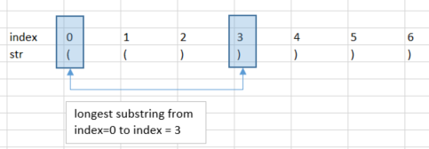
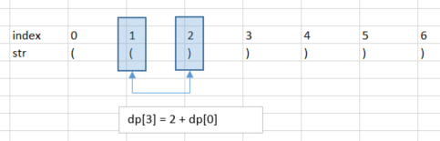
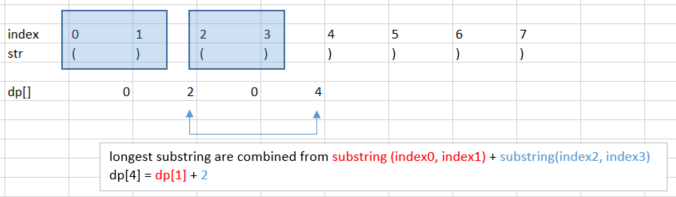
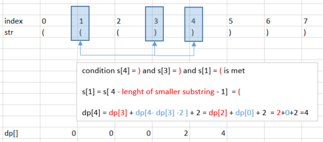

# Description

Given a string containing just the characters `(` and `)`, find the length of the longest valid (well-formed) parentheses substring.

*Note*: the substrings could be embedded. For example: `(())`    . THe smaller substring `()` of size 2 is part of the larger substring of size 4

## **Example 1:**
```
Input: s = "(()"
Output: 2
Explanation: The longest valid parentheses substring is "()".
```

## **Example 2:**
```
Input: s = ")()())"
Output: 4
Explanation: The longest valid parentheses substring is "()()".
```

## **Example 3:**
```
Input: s = ""
Output: 0
```

# Solution 1: Brute Force.
* since there are embedded substrings, to generate substrings, we need double for loop. Complexity if O(n^2)
* for each substrings, valid parenthesis are checked by looking for `(` and `)`. A monostack could be used.
    * push `(` to monostack.
    * pop top from monostack when encounter `)`.
    * if stack is not empty when substring end is encountered, then there is no valid parenthesis.

# Solution 2: Monostack.
* to improve the complexity, instead of generating substrings, we could use monostack to both check for valid parenthesis and calculate substring size.
    * when encounter `(`, push its index in the substring to monostack.
    * when encounter `)`, pop out from monostack, calculate substring length by subtracting the indexes: `size = index of `)`  -  index of `(` `
    * maxLength is updated accordingly after every time that substring length is calculated

    

    * *Note*: implementation can consider to push index of both `(` and `)` to the stack and process the stack from there.
    * *Note*: stop condition is not empty stack but when reaching end of string.

## Algorithm:
1. step 1: condition to add to stack
2. step 2: condition to pop from stack and make calculating
3. step 3: stop condition

# Solution 3: DP programming
* using 1D dp equation to calculate substring length.
    1. the value of `dp[i]` is the length of the longest substring at `index i`

    

* There are 2 scenarios to update DP equations.
    1. if ` s[i] = `)` ` and ` s[i-1]= `(` `   , then the length is calculated by `dp[i] = dp[i-1] + 2`

    

    2. if ` s[i] = `)` ` and ` s[i-1]= `)` ` and there is another smaller substring whose length is indicated by `dp[i-1]` , then the length is calculated by `dp[i] = dp[i-1] + dp[i + dp[i-1] -2] + 2`

    