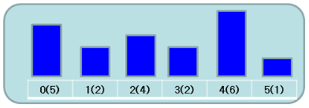

# Description:

Given an array that illustrates the heighs for each building from west to east (index increases), a rooftop garden on top of a building can see other buildings on its east if the buildings are shorter than it.

For example, the following buildings and heighs are given in H[] = {5,2,4,2,6,1}




```
You can see the rooftop of building 1,2, and 3 from building 0              => 3 buildings
You can see no rooftop of building from building 1                          => 0 buildings
You can see the rooftop of building 3 from building 2                       => 1 buildings
You can see no rooftop from building 3                                      => 0 buildings
You can see the rooftop of building 5 from building 4                       => 1 building
You can see no rooftop from building 5                                      => 0 buildings

Total 5 buildings
```

* **Input**
- 1st line: Number of N buildings. `6<N<80000`
- 2nd line: the heigh of N buildings.
* **Output**
The sum of rooftop that can be seen in each building.

# Solution 1: Monostack
* see also similar problem with monostack method: Next Greater Element https://leetcode.com/problems/next-greater-element-i/