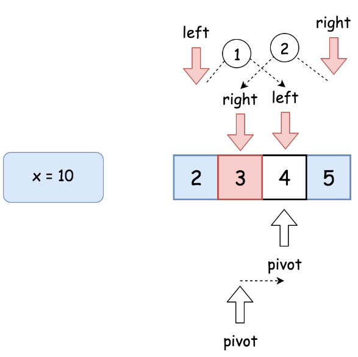
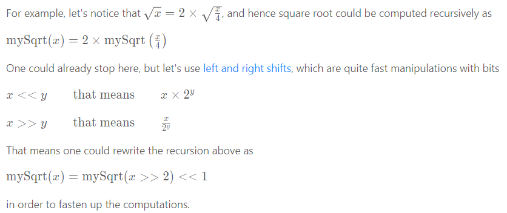

# Explanation:
Given a non-negative integer x, compute and return the square root of x.

Since the return type is an integer, the decimal digits are truncated, and only the integer part of the result is returned.

Note: You are not allowed to use any built-in exponent function or operator, such as pow(x, 0.5) or x ** 0.5.

## Example 1:
```
Input: x = 4
Output: 2
```

## Example 2:
```
Input: x = 8
Output: 2
Explanation: The square root of 8 is 2.82842..., and since the decimal part is truncated, 2 is returned.
``` 

## Constraints:
```
0 <= x <= 2^31 - 1
```

# Solution: Binary Search
* The `integer` value of squrt(x) if `x<2` is `x`. In other word, the integer value of `sqrt(1) = 1`
* The `integer` value of `sqrt(x)` has the range from `2` to `x/2`.
* For example, if `x= 10`, binary search could be run to find value sqrt(10) in the range from `2` to `5`: 
    * if `mid*mid==x`, return `mid`
    * if `mid*mid >x`, search in the lower left: `high = mid - 1`;
    * if `mid*mid <x`, search in the higher right: `low = mid + 1`;
## Complexity: 
* Time complexity O(logN)
* Space complexity O(1)

# Solution: Recursion and Bit shift
* Base case: `if x < 2 sqrt(x) = x`
* For other cases, observe that: 
## Complexity: 
* Time complexity O(logN)
* Space complexity O(1)

# Solution: Newton method (fastest method)


