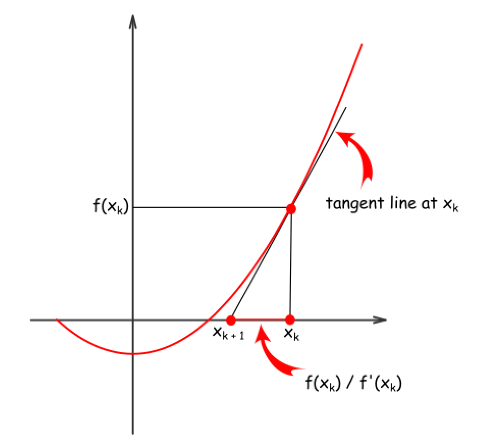
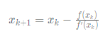
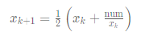
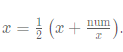

# Description: 
Given a positive integer num, write a function which returns True if num is a perfect square else False.

Follow up: Do not use any built-in library function such as sqrt.

## Example 1:
```
Input: num = 16
Output: true
```
## Example 2:
```
Input: num = 14
Output: false
``` 

## Constraints:
```
1 <= num <= 2^31 - 1
```

# Solution: Newton Method
* The problem is to find a root of
```
f(x) = x^2 - num = 0, 
```
* take `num = f(x) = x^2`, num is parabola. If num is a parabola, then there is an x<sub>a</sub> that could be found via tangent line. 

* There is a guess x<sub>k</sub> .     
* To compute next guess x<sub>{k + 1}</sub>   
* let's approximate `f(x_k)` by its tangent line, that would result in  or  

## Algorithm:
* Take `num / 2` as a seed.
* While `x * x > num`, 
    * compute the next guess using Newton's method: 
    * Return x * x == num
* Illustration of how successive x<sub>k</sub> would be found 
## Complexity:
* Time complexity is O(logN) because **guess sequence converges quadratically.**

# Solution: Binary Search:
## Complexity:
* Time complexity is O(logN) because **master theorem**